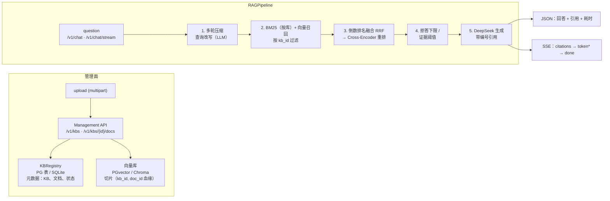

<p align="center">
  
</p>

# 企业知识库 RAG 问答

> [English](README.md) | 简体中文

面向文档问答场景的企业级 RAG 服务——多知识库管理、文档生命周期、混合检索、流式回答与多轮对话。功能对标主流知识库产品（Dify / FastGPT / RAGFlow）的能力线，用评测套件说话，不放营销数字。

服务是 **API-first 设计**：所有能力都以 REST 端点交付（`/docs` 有交互式 Swagger，下方有 curl 示例），v0.6 不做 Web 控制台。


[](https://github.com/zeng-bohan/enterprise-rag-qa/actions/workflows/ci.yml)


## 核心指标一览

由项目自带评测套件实测——方法与完整报告见[测试与评估](#测试与评估)。

| 指标 | 结果 |
| --- | --- |
| Recall@1 / Recall@3 / Recall@5（n=334，混合检索） | **87.4%** / **97.9%** / **98.2%** |
| Faithfulness（RAGAS，n=100） | **94.1%** |
| 答案相关性（RAGAS） | **88.7%** |
| 幻觉率（RAGAS） | **5.9%** |
| P95 延迟（异步流水线改造后） | 32s → **10s** |

## 功能特性

**知识库管理**
- 多知识库；文档按库上传，同步完成索引（解析 → 切片 → 向量化 → 挂载）。
- 文档生命周期带完整切片血缘（每个切片都带 `kb_id` / `doc_id`）：列表、删除文档（切片随之删除）、删除知识库（全部随之删除）。
- 一套接口两种存储档位：**PostgreSQL + pgvector**（生产，docker compose）或 **Chroma + SQLite 注册表**（零依赖本地模式）。通过 `VECTOR_BACKEND` 切换。

**检索**
- 混合召回：BM25（jieba）+ 向量检索，倒数排名融合（RRF），再经 Cross-Encoder 重排。
- BM25 索引按知识库独立，懒构建，文档变更即失效。
- 双路拒答（检索前分数下限 + 重排分数下限）——知识库外的问题不烧一个 LLM token。
- `POST /v1/retrieval-test`——不生成回答的检索命中测试（对标 Dify / FastGPT 的「召回测试」页）。

**生成**
- 编号引用、接地 prompt、拒答兜底。
- SSE 流式回答：`citations → token* → done` 事件协议。
- 多轮对话：追问先被压缩成独立查询再进检索；对话历史注入生成。
- 语义缓存以「问题 + 命中文档集合」为键（知识库变更自动失效）；多轮请求按设计绕过缓存。

**运维**
- Prometheus 指标（`/metrics`）、分阶段延迟直方图、缓存/LLM 计数器。
- Redis 不可用时优雅降级；本地模式完全不需要 Redis。
- `/v1` 全部路由可选 API Key 认证（`X-API-Key`）；健康检查与指标保持开放。
- 项目评测集实测：Recall@1 **87.4%**、Faithfulness **94.1%**，异步流水线改造后 P95 延迟从 **32s** 降到 **10s**。

## 系统架构



## 快速开始

### 1. 创建环境

```bash
# Windows
python -m venv .venv
.venv\Scripts\python -m pip install -r requirements.txt
copy .env.example .env

# macOS / Linux
python3 -m venv .venv
.venv/bin/python -m pip install -r requirements.txt
cp .env.example .env
```

在 `.env` 中配置你的 `DEEPSEEK_API_KEY`。

### 2. 启动 PostgreSQL 和 Redis（生产档位）

```bash
docker compose up -d
```

本地不起 Docker 时，在 `.env` 中设 `VECTOR_BACKEND=chroma`——知识库注册表回退到本地 SQLite 文件，且不需要 Redis。

### 3. 导入并运行

```bash
# Windows
.venv\Scripts\python scripts/ingest_docs.py        # 导入默认知识库；支持 --kb 名称 / --rebuild
.venv\Scripts\python -m uvicorn app.main:app --host 127.0.0.1 --port 8000

# macOS / Linux
.venv/bin/python scripts/ingest_docs.py
.venv/bin/python -m uvicorn app.main:app --host 127.0.0.1 --port 8000
```

打开 `http://127.0.0.1:8000/docs` 查看交互式 API 文档。

### 4. 试一试

```bash
# 提问（非流式）
curl -X POST http://127.0.0.1:8000/v1/chat -H "Content-Type: application/json" \
  -d '{"question": "员工请年假需要提前几天申请？"}'

# 提问（SSE 流式：citations → token* → done）
curl -N -X POST http://127.0.0.1:8000/v1/chat/stream -H "Content-Type: application/json" \
  -d '{"question": "年假有多少天？"}'

# 建库、传文档、检索命中测试
curl -X POST http://127.0.0.1:8000/v1/kbs -H "Content-Type: application/json" -d '{"name": "帮助中心"}'
curl -X POST http://127.0.0.1:8000/v1/kbs/<kb_id>/documents -F "file=@手册.pdf"
curl -X POST http://127.0.0.1:8000/v1/retrieval-test -H "Content-Type: application/json" \
  -d '{"query": "年假政策", "kb_id": "<kb_id>"}'
```

## API

| 方法 | 路径 | 说明 |
| --- | --- | --- |
| POST | `/v1/chat` | 提问；支持 `kb_id` 与 `history`（多轮）。返回回答、引用、耗时。 |
| POST | `/v1/chat/stream` | 同上，SSE 形式：`citations → token* → done`。 |
| POST | `/v1/kbs` | 创建知识库。 |
| GET | `/v1/kbs` | 知识库列表，含文档/切片计数。 |
| DELETE | `/v1/kbs/{kb_id}` | 删除知识库及其全部切片。 |
| POST | `/v1/kbs/{kb_id}/documents` | 上传文件（multipart `file`，pdf/md/txt）；解析、切片、索引。 |
| GET | `/v1/kbs/{kb_id}/documents` | 文档列表，含状态与切片计数。 |
| DELETE | `/v1/kbs/{kb_id}/documents/{doc_id}` | 删除文档及其切片。 |
| POST | `/v1/retrieval-test` | 不生成回答的检索命中测试。 |
| GET | `/health` | 健康检查。 |
| GET | `/metrics` | Prometheus 请求/延迟/缓存/LLM 指标。 |

## 项目结构

```text
app/
├── main.py            # FastAPI 应用（lifespan：确保默认知识库存在）
├── config.py          # 环境配置（.env，pydantic-settings）
├── schemas.py         # 请求/响应模型
├── api/
│   ├── deps.py        # 共享 pipeline 单例
│   ├── chat.py        # /v1/chat（JSON + SSE 流式）
│   └── manage.py      # 知识库/文档生命周期、检索命中测试
├── core/
│   ├── auth.py        # X-API-Key 依赖（未配置时开放）
│   ├── llm.py         # DeepSeek 客户端（OpenAI 兼容）
│   ├── embeddings.py  # 本地 BGE 向量化（fastembed/ONNX），带缓存
│   ├── cache.py       # Redis 缓存，优雅降级
│   ├── executor.py    # CPU 密集任务的有界线程池
│   └── metrics.py     # Prometheus 指标
└── rag/
    ├── registry.py         # 知识库/文档注册表（PG 表 / SQLite）
    ├── document_loader.py  # PDF / Markdown / TXT 解析
    ├── chunker.py          # 中文语义切片
    ├── query_rewriter.py   # LLM 查询改写（供 BM25 召回）
    ├── bm25_index.py       # jieba + BM25Okapi 关键词索引
    ├── vector_store.py     # PGvector / Chroma 双后端，一套接口
    ├── retriever.py        # 按库混合召回 + RRF 融合 + 重排 + 拒答
    ├── reranker.py         # Cross-Encoder 重排（fastembed）
    ├── generator.py        # 引用、拒答、语义缓存、多轮、流式
    └── pipeline.py         # 编排 + 分阶段计时
scripts/
├── ingest_docs.py      # 将 data/docs 导入知识库（逐文档血缘）
├── ask.py              # 命令行提问
├── fetch_corpus.py     # 拉取源文档
├── gen_qa_set.py       # 生成切片接地的 QA 评测集
├── eval_recall.py      # Recall@1/3/5（对比纯向量基线）
├── eval_ragas.py       # RAGAS faithfulness / relevancy
└── bench.py            # 延迟基准
tests/                  # 89 个离线测试（无需 PG / Redis / 模型下载）
data/qa_set/            # QA 评测集与指标报告
docker-compose.yml
```

## 测试与评估

**单元/集成测试——完全离线。** 测试套件对 LLM、Cross-Encoder、向量库、注册表和 Redis 全部打桩，无需 PostgreSQL、Redis、模型下载或网络：

```bash
pip install -r requirements-dev.txt
pytest tests -q        # 89 passed
```

**检索评测。** `scripts/gen_qa_set.py` 构建切片接地的 QA 集（每题只能由唯一切片回答；10% 人工抽检），`scripts/eval_recall.py` 测量混合检索相对纯向量基线的 Recall@k：

- Recall@1 **87.4%** / Recall@3 **97.9%** / Recall@5 **98.2%**（n=334，混合检索）——完整报告见 `data/qa_set/recall_report.json`

**生成质量。** `scripts/eval_ragas.py` 用 RAGAS 为生成回答打分：

- Faithfulness **94.1%**、答案相关性 **88.7%**、幻觉率 **5.9%**（n=100）——完整报告见 `data/qa_set/ragas_report.json`

## 设计决策

每个关键选型的理由都沉淀在 [docs/DESIGN.md](docs/DESIGN.md)（16 节）：LLM / 向量化 / 向量库选型、中文语义切片、为什么做混合检索 + RRF + 重排、双路拒答设计、缓存键设计、流式事件协议、异步并发改造的压测复盘。

## 路线图

v0.6 有意不做、按优先级排列的主流知识库能力：大文件异步导入、父子（小块 retrieval/大块 generation）切片、Office 格式解析（docx/xlsx/pptx）、按库访问控制、连接器同步（网页/Confluence/飞书）、回答反馈闭环。

## 许可证

[MIT](LICENSE)
