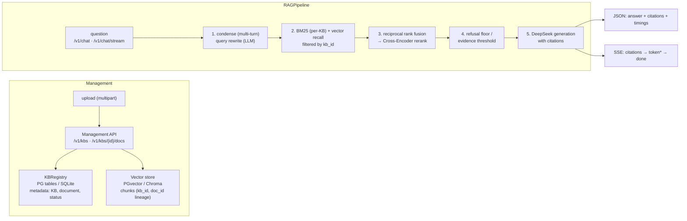

<p align="center">
  
</p>

<h1 align="center">企业知识库 RAG 问答</h1>

<p align="center">
  面向文档问答的企业级 RAG 服务 — 多知识库管理、混合检索、流式回答与多轮对话，用评估套件说话，不用营销数字。
</p>

<p align="center">
  <a href="README.md">English</a> | 简体中文
</p>


[](https://github.com/zeng-bohan/enterprise-rag-qa/actions/workflows/ci.yml)


服务 **API 优先**：所有能力都以 REST 端点交付（`/docs` 有交互式 Swagger，下文附 curl 配方）— v0.6 没有 Web 控制台。

## 结果速览

数据来自仓库自带的评估套件 — 方法论与完整报告见[测试与评估](#测试与评估)。

> **评估方法论正在修订。** 以下数字是已交付管线的真实测量值，但对评估集构造方式的审计暴露了三个局限，将改变数字的呈现方式（置信区间、分层抽样、非 DeepSeek 的评审模型、拒答率基线）。跟踪：整改计划的 21–28 号票。有两个事实值得提前说明，均从 `data/qa_set/` 的文件重新计算过：334 个问题只覆盖 **80 个不同的 gold chunk**（每 chunk 约 4.2 个问题，所以有效样本是约 80 个相关试验，而非 334 个独立试验）；n=100 的 RAGAS 子集是 `qa_set[:100]` — 一个头部切片，恰好来自 **单一源文档**。

| 指标 | 结果 |
| --- | --- |
| Recall@1 / Recall@3 / Recall@5（n=334 行 / 80 个唯一 gold chunk，混合检索） | **87.4%** / **97.9%** / **98.2%** |
| Faithfulness（RAGAS，n=100 头部切片，自评） | **94.1%** |
| Answer relevancy（RAGAS） | **88.7%** |
| 幻觉率（RAGAS） | **5.9%** |
| P95 时延（异步管线改造后） | 32s → **10s** — 仅尾时延；两次运行吞吐都在 ~0.9 QPS，「改后」数值为预热后测量。尚未作为正式报告发布（26 号票）。 |

## 功能特性

**知识库管理**
- 多知识库；文档按 KB 上传并同步索引（解析 → 切块 → 嵌入 → 挂链）。
- 文档生命周期带完整 chunk 血缘（每个 chunk 都有 `kb_id` / `doc_id`）：列表、删文档（chunk 随之删除）、删 KB（全部随之删除）。
- 一个接口两种存储档位：**PostgreSQL + pgvector**（生产，docker compose）或 **Chroma + SQLite 注册表**（零依赖本地）。用 `VECTOR_BACKEND` 切换。

**检索**
- 混合召回：BM25（jieba）+ 向量检索，倒数排序融合（RRF），再过 Cross-Encoder 重排。
- 每 KB 一份 BM25 索引，懒构建、文档变更即失效。
- 双路径拒答（检索前分数下限 + 重排下限）— 知识库外的问题不烧一个 LLM token。
- `POST /v1/retrieval-test` — 不生成回答的命中测试（对标 Dify / FastGPT 的「检索测试」页）。

**生成**
- 编号引用、有据提示词、拒答兜底。
- SSE 流式回答：`citations → token* → done` 事件协议。
- 多轮对话：追问先被改写为独立查询再检索；对话历史注入生成。
- 语义缓存按「问题 + 命中文档集」为键（KB 变更自动失效）；多轮请求按设计绕过缓存。

**运维**
- Prometheus 指标（`/metrics`）、分阶段时延直方图、缓存/LLM 计数器。
- Redis 不可用时优雅降级；本地模式完全不需要 Redis。
- 所有 `/v1` 路由可选 API-key 认证（`X-API-Key`）；健康检查与指标保持开放。

## 技术栈

| 层 | 技术 |
| --- | --- |
| API | FastAPI、pydantic-settings、SSE 流式 |
| 检索 | BM25 (jieba) + 向量召回、倒数排序融合、Cross-Encoder 重排 (fastembed) |
| 嵌入 | BGE，本地 fastembed/ONNX 推理，带缓存 |
| 生成 | DeepSeek（OpenAI 兼容 API） |
| 存储 | PostgreSQL + pgvector **或** Chroma + SQLite 注册表；Redis 缓存（优雅降级） |
| 可观测 | Prometheus `/metrics`、分阶段时延直方图 |
| 评估 | RAGAS faithfulness/relevancy、Recall@k 基准、pytest（离线 + 契约） |
| 运维 | Docker Compose、GitHub Actions CI |

## 架构


```mermaid
flowchart LR
    subgraph MGMT[Management]
        U["upload (multipart)"] --> API["Management API<br/>/v1/kbs · /v1/kbs/{id}/docs"]
        API --> REG["KBRegistry<br/>PG tables / SQLite<br/>metadata: KB, document, status"]
        API --> VS["Vector store<br/>PGvector / Chroma<br/>chunks (kb_id, doc_id lineage)"]
    end

    subgraph PIPE[RAGPipeline]
        Q["question<br/>/v1/chat · /v1/chat/stream"] --> C["1. condense (multi-turn)<br/>query rewrite (LLM)"]
        C --> R["2. BM25 (per-KB) + vector recall<br/>filtered by kb_id"]
        R --> F["3. reciprocal rank fusion<br/>→ Cross-Encoder rerank"]
        F --> RF["4. refusal floor /<br/>evidence threshold"]
        RF --> G["5. DeepSeek generation<br/>with citations"]
    end

    G --> J["JSON: answer + citations + timings"]
    G --> S["SSE: citations → token* → done"]
```

## 快速开始

### 1. 创建环境

```bash
# Windows
python -m venv .venv
.venv\Scripts\python -m pip install -r requirements.txt
copy .env.example .env

# macOS / Linux
python3 -m venv .venv
.venv/bin/python -m pip install -r requirements.txt
cp .env.example .env
```

在 `.env` 里设置 `DEEPSEEK_API_KEY`。

### 2. 启动 PostgreSQL 和 Redis（生产档位）

```bash
docker compose up -d
```

不用 Docker 的本地运行：在 `.env` 中设置 `VECTOR_BACKEND=chroma` — KB 注册表回退到本地 SQLite 文件，不需要 Redis。

### 3. 灌库并启动

```bash
# Windows
.venv\Scripts\python scripts/ingest_docs.py        # 灌入默认 KB；支持 --kb 名称 / --rebuild
.venv\Scripts\python -m uvicorn app.main:app --host 127.0.0.1 --port 8000

# macOS / Linux
.venv/bin/python scripts/ingest_docs.py
.venv/bin/python -m uvicorn app.main:app --host 127.0.0.1 --port 8000
```

打开 `http://127.0.0.1:8000/docs` 查看交互式 API 文档。

### 4. 试一试

```bash
# 提问（非流式）
curl -X POST http://127.0.0.1:8000/v1/chat -H "Content-Type: application/json" \
  -d '{"question": "员工请年假需要提前几天申请？"}'

# 提问（SSE 流式：citations → token* → done）
curl -N -X POST http://127.0.0.1:8000/v1/chat/stream -H "Content-Type: application/json" \
  -d '{"question": "年假有多少天？"}'

# 建知识库、传文档、命中测试
curl -X POST http://127.0.0.1:8000/v1/kbs -H "Content-Type: application/json" -d '{"name": "帮助中心"}'
curl -X POST http://127.0.0.1:8000/v1/kbs/<kb_id>/documents -F "file=@手册.pdf"
curl -X POST http://127.0.0.1:8000/v1/retrieval-test -H "Content-Type: application/json" \
  -d '{"query": "年假政策", "kb_id": "<kb_id>"}'
```

## API

| 方法 | 路径 | 说明 |
| --- | --- | --- |
| POST | `/v1/chat` | 提问；支持 `kb_id` 与 `history`（多轮）。返回答案、引用、耗时。 |
| POST | `/v1/chat/stream` | 同上，SSE 流式：`citations → token* → done`。 |
| POST | `/v1/kbs` | 创建知识库。 |
| GET | `/v1/kbs` | 知识库列表，含文档/chunk 数。 |
| DELETE | `/v1/kbs/{kb_id}` | 删除知识库及其全部 chunk。 |
| POST | `/v1/kbs/{kb_id}/documents` | 上传文件（multipart `file`，pdf/md/txt）；解析、切块、索引。 |
| GET | `/v1/kbs/{kb_id}/documents` | 文档列表，含状态与 chunk 数。 |
| DELETE | `/v1/kbs/{kb_id}/documents/{doc_id}` | 删除文档及其 chunk。 |
| POST | `/v1/retrieval-test` | 不生成回答的检索命中测试。 |
| GET | `/health` | 健康检查。 |
| GET | `/metrics` | Prometheus 请求、时延、缓存与 LLM 指标。 |

## 项目结构

```text
app/
├── main.py            # FastAPI 应用（lifespan：确保默认 KB 存在）
├── config.py          # 环境配置（.env，pydantic-settings）
├── schemas.py         # 请求/响应模型
├── api/
│   ├── deps.py        # 共享管线单例
│   ├── chat.py        # /v1/chat（JSON + SSE 流式）
│   └── manage.py      # KB / 文档生命周期、检索命中测试
├── core/
│   ├── auth.py        # X-API-Key 依赖（未设置时开放）
│   ├── llm.py         # DeepSeek 客户端（OpenAI 兼容）
│   ├── embeddings.py  # 本地 BGE 嵌入（fastembed/ONNX），带缓存
│   ├── cache.py       # Redis 缓存，优雅降级
│   ├── executor.py    # CPU 密集工作的有界线程池
│   └── metrics.py     # Prometheus 指标
└── rag/
    ├── registry.py         # KB / 文档注册表（PG 表 / SQLite）
    ├── document_loader.py  # PDF / Markdown / TXT 解析
    ├── chunker.py          # 中文感知的语义切块
    ├── query_rewriter.py   # BM25 召回用的 LLM 查询改写
    ├── bm25_index.py       # jieba + BM25Okapi 关键词索引
    ├── vector_store.py     # PGvector / Chroma 双后端同接口
    ├── retriever.py        # 每 KB 混合召回 + RRF 融合 + 重排 + 拒答
    ├── reranker.py         # Cross-Encoder 重排（fastembed）
    ├── generator.py        # 引用、拒答、语义缓存、多轮、流式
    └── pipeline.py         # 编排 + 分阶段计时
scripts/
├── ingest_docs.py      # 把 data/docs 灌入 KB（逐文档血缘）
├── ask.py              # CLI 提问
├── fetch_corpus.py     # 拉取源文档
├── gen_qa_set.py       # 生成锚定 chunk 的 QA 评估集
├── eval_recall.py      # Recall@1/3/5（混合 vs 纯向量基线）
├── eval_ragas.py       # RAGAS faithfulness / relevancy
└── bench.py            # 时延基准
tests/                  # 89 个离线测试（无需 PG / Redis / 模型下载）
data/qa_set/            # QA 评估集与指标报告
docker-compose.yml
```

## 测试与评估

**单元 / 集成测试 — 完全离线。** 测试套件打桩了 LLM、Cross-Encoder、向量库、注册表与 Redis，无需 PostgreSQL、Redis、模型下载或网络即可运行：

```bash
pip install -r requirements-dev.txt
pytest tests -q                          # 全部（93 离线 + 34 后端契约）
pytest tests -m "not contract" -q        # 仅离线：无 PostgreSQL、无 Redis、无模型
pytest tests -m contract -q              # 需要先 `docker compose up -d`
```

套件刻意分成两半。离线那一半让项目好上手 — 谁克隆下来都能秒级跑完全部。但它打桩了存储层，等于看不见 SQL：`PGvectorStore`、`ChromaStore`、`PGKBRegistry` 和 `BGEEmbeddings` 从未被任何离线测试引用过，一个 PostgreSQL 独有的 bug（注册表参数占位符写错）带着全绿的 CI 活到了 `main`。契约那一半正好补上这个缺口：两个后端跑 **同一组断言** — KB/文档生命周期、级联删除、跨 KB 隔离，以及拒答阈值附近的跨后端分数尺度一致性。CI 里缺 PostgreSQL 是 **失败**，不是跳过。

**检索评估。** `scripts/gen_qa_set.py` 构建锚定 chunk 的 QA 集（每个问题只能由单一 chunk 回答；10% 人工抽检），`scripts/eval_recall.py` 测量混合检索器相对纯向量基线的 Recall@k：

- Recall@1 **87.4%** / Recall@3 **97.9%** / Recall@5 **98.2%**（n=334 行 / 80 个唯一 gold chunk，混合）— 完整报告在 `data/qa_set/recall_report.json`

**生成质量。** `scripts/eval_ragas.py` 用 RAGAS 为生成的答案打分：

- Faithfulness **94.1%**、answer relevancy **88.7%**、幻觉率 **5.9%**（QA 集的 n=100 头部切片，由与生成同族的模型评审）— 完整报告在 `data/qa_set/ragas_report.json`

以上两套评估都在重构中（分层抽样、chunk 级去重加置信区间、独立评审模型、负例查询集测拒答率、落盘基准报告）；见 21–28 号票。在此之前请把上面的数字当作 *已测量但方法论尚未干净*。

## 设计决策

每个重大选择背后的理由都写在 [docs/DESIGN.md](docs/DESIGN.md)（16 节，中文）：LLM / 嵌入 / 向量库选型、中文感知切块、为什么混合检索 + RRF + 重排、双路径拒答设计、缓存键设计、流式事件协议，以及异步并发的时延复盘。

## 注意事项与避坑

- **v0.6 没有 Web 控制台。** 服务是 API 优先 — `/docs` 的交互式 Swagger 就是界面；上面的 curl 配方覆盖常见流程。
- **零依赖本地跑。** `VECTOR_BACKEND=chroma` 用本地 SQLite 注册表 + Chroma 替代 PostgreSQL + Redis — 不装 Docker 也能试管线。
- **契约测试不可跳过。** `pytest -m contract` 需要先 `docker compose up -d`；CI 里缺 PostgreSQL 记失败，不是跳过 — 契约那一半的存在意义正是堵这个缺口。
- **评估数字诚实但非终稿。** 是已交付管线的真实测量，待方法论修订（21–28 号票）— 见顶部的说明。
- **认证是可选的。** 未设置 `API_KEY` 时所有 `/v1` 路由开放；健康检查与指标永远开放。语义缓存按设计对多轮请求绕行 — 追问的回答永远不会从缓存出。
- **Windows 路径。** venv 解释器在 Windows 上是 `.venv\Scripts\python`，其他平台是 `.venv/bin/python` — 上面的片段两种都给了。

## 路线图

v0.6 刻意未做的主流知识库能力，按优先级：大文件异步灌库、父子（small-to-big）切块、Office 格式解析（docx/xlsx/pptx）、按 KB 访问控制、连接器同步（web/Confluence/飞书）、回答反馈闭环。

## 支持

Bug、问题与功能建议：[提 Issue](https://github.com/zeng-bohan/enterprise-rag-qa/issues)。Bug 报告请附复现步骤与相关日志或响应体。

## 贡献

个人维护项目。欢迎提 Issue 反馈 Bug 与想法；代码改动请先开 Issue 对齐方案，再投入时间。

## 许可证

[MIT](LICENSE)
